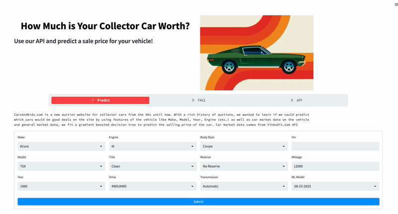

<!-- Improved compatibility of back to top link: See: https://github.com/othneildrew/Best-README-Template/pull/73 -->

<!--
*** Thanks for checking out the Best-README-Template. If you have a suggestion
*** that would make this better, please fork the repo and create a pull request
*** or simply open an issue with the tag "enhancement".
*** Don't forget to give the project a star!
*** Thanks again! Now go create something AMAZING! :D
-->

<!-- PROJECT SHIELDS -->
<!--
*** I'm using markdown "reference style" links for readability.
*** Reference links are enclosed in brackets [ ] instead of parentheses ( ).
*** See the bottom of this document for the declaration of the reference variables
*** for contributors-url, forks-url, etc. This is an optional, concise syntax you may use.
*** https://www.markdownguide.org/basic-syntax/#reference-style-links
-->
[![MIT License][license-shield]][license-url] [![LinkedIn][linkedin-shield]][linkedin-url]

<!-- PROJECT LOGO -->
 

    
  <h1 align="center"> <a href=http://CarCollectorPricing.com> CarCollectorPricing.com </h1>
  <h2 align="center">
    Get the best price for your collector vehicle!
  </h2>

<!-- ABOUT THE PROJECT -->
## About The Project

This GitHub repository serves as the home for [CarCollectorPricing.com](http://CarCollectorPricing.com). The primary goal of this project is to gather comprehensive data [CarsandBids.com](https://carsandbids.com/) and utilize this data to train a predictive model that can estimate car sales prices. Whether you're a car enthusiast, a data scientist, or simply interested in predictive modeling, this project offers valuable insights into the world of automotive auctions and machine learning.

Car auctions are a crucial marketplace for both buyers and sellers in the automotive industry. Buyers often seek opportunities to purchase vehicles at competitive prices, while sellers aim to maximize their returns. Accurate price predictions can significantly aid in these endeavors. This project was born out of the desire to harness the power of data science and machine learning to provide valuable pricing guidance to both buyers and sellers in the car auction ecosystem.

(<a href="#readme-top">back to top</a>)

<!-- GETTING STARTED -->
## Automation

<!-- CONTRIBUTING -->
## Contributing

Contributions are what make the open source community such an amazing place to learn, inspire, and create. Any contributions you make are **greatly appreciated**.

If you have a suggestion that would make this better, please fork the repo and create a pull request. You can also simply open an issue with the tag "enhancement".
Don't forget to give the project a star! Thanks again!

1. Fork the Project
2. Create your Feature Branch (`git checkout -b feature/AmazingFeature`)
3. Commit your Changes (`git commit -m 'Add some AmazingFeature'`)
4. Push to the Branch (`git push origin feature/AmazingFeature`)
5. Open a Pull Request

(<a href="#readme-top">back to top</a>)

<!-- LICENSE -->
## License

Distributed under the MIT License. See `LICENSE.txt` for more information.

(<a href="#readme-top">back to top</a>)

<!-- CONTACT -->
## Contact

Adam Lang 

[Email](adamglang96@gmail.com) 

[Project Link](https://github.com/AdamLang96/CarSalesModel)

(<a href="#readme-top">back to top</a>)

<!-- MARKDOWN LINKS & IMAGES -->
<!-- https://www.markdownguide.org/basic-syntax/#reference-style-links -->
[linkedin-shield]: https://img.shields.io/badge/-LinkedIn-black.svg?style=for-the-badge&logo=linkedin&colorB=555
[linkedin-url]: https://www.linkedin.com/in/adam-lang96/
[license-shield]: https://img.shields.io/github/license/othneildrew/Best-README-Template.svg?style=for-the-badge
[license-url]: https://github.com/othneildrew/Best-README-Template/blob/master/LICENSE.txt
[next-url]: https://nextjs.org/

